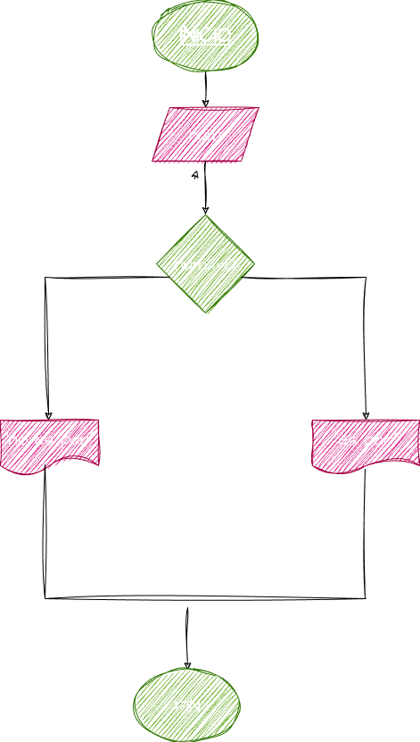

# Par_Impar
costrir un programa que lea un numero entero y que determine si se trata de un numero impar o par

## Input 

se detectara si el numero es par o impar ,
 si la divicion en ese numero entre el 2 el residuo es igual y si es 0 sera par 

 # Diseño 
 
